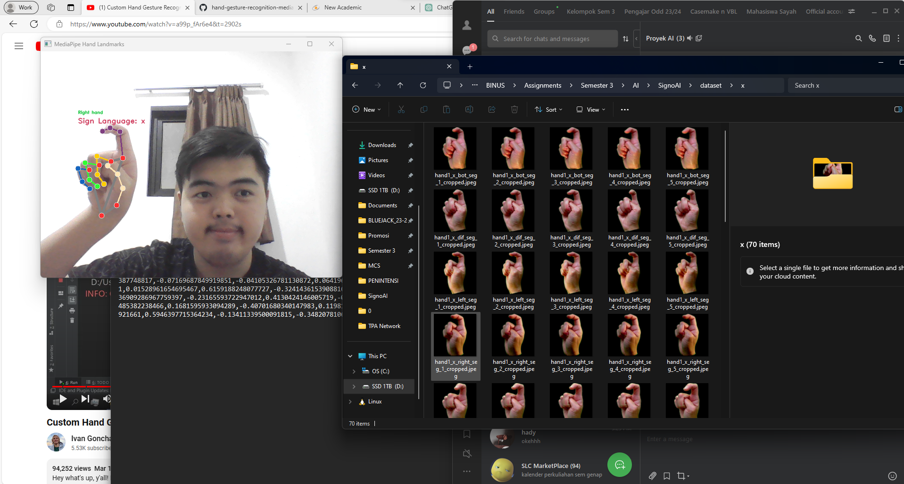

## signoAI-project
Sign Language classifier AI

SignoAI is a machine learning model designed to recognize and classify hand gestures used in sign language. The goal of this project is to assist with translating sign language gestures into text or speech, making communication more accessible for individuals with hearing impairments.

## Features
<b>Real-time Gesture Recognition:</b> The model detects and classifies hand gestures from video or image input.
<b>Accuracy Optimization:</b> Trained using state-of-the-art deep learning techniques for high accuracy even with diverse backgrounds and lighting conditions.

## Tech Stack
- Framework: Tensorflow
- Computer Vision: OpenCV for real-time video input and hand tracking
- Deep Learning: DCNN for gesture classification
- MediaPipe: Hand Landmark Detection

## Future Enhancement
- <b>Multi-language Support:</b> Expand to support more sign languages and dialects.
- <b>Sentence Formation:</b> Develop the ability to recognize multiple gestures in sequence to form complete sentences.
- <b>Mobile Integration:</b> Create a mobile app using the model to translate sign language in real-time on mobile devices.

## Installation Guide
Step by step:
1. Download media pipe hand landmark task model from https://developers.google.com/mediapipe/solutions/vision/hand_landmarker
2. Change the model path in the main.py to be your/absolute/path/to/hand_landmarker.task
3. Create sign_detection dataset by running all cells in sign_detection.ipynb
4. Create sign_recognition model by running all cells in sign_recognition.ipynb
5. Run `python main.py`

